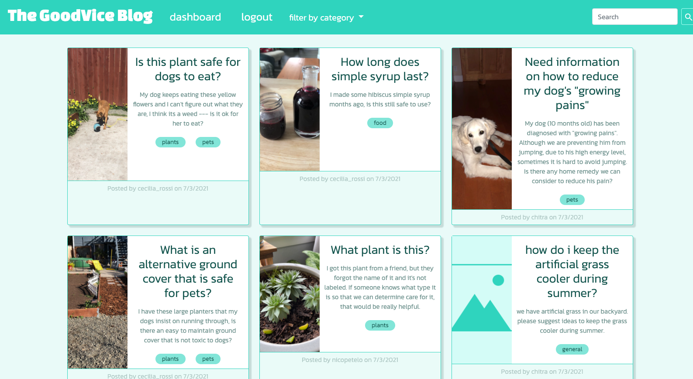
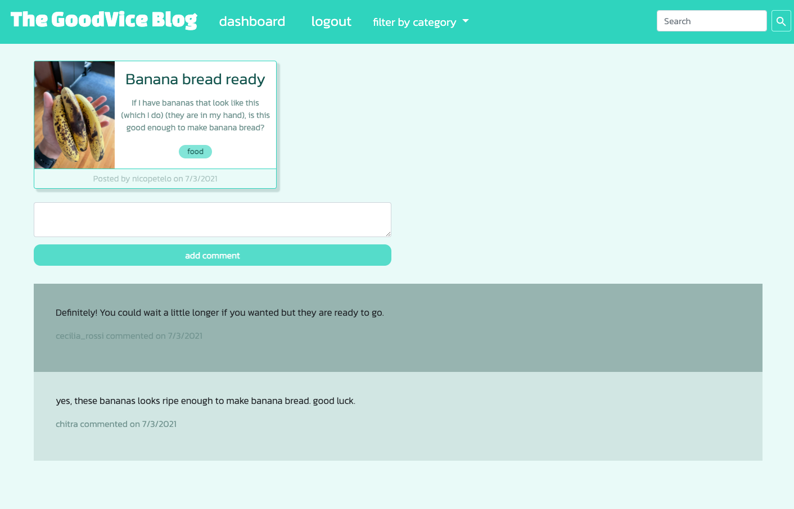

# The Goodvice Blog

## Description: 
> A small scale app, enabling users to get advice from their community on everyday things and allowing them to quickly search by categories or keywords.

## Table of Contents
* [Installation](#Installation)
* [Usage](#Usage)
* [Screenshots](#Screenshots)
* [Technologies](#Technologies)
* [Questions](#Questions)

## Installation:
To install the application clone the repository and run 'npm i' in the command line to install dependencies.

## Usage:
Application is deployed here: https://the-goodvice-blog.herokuapp.com/

To start posting and commenting on existing posts create an account or login. To create a post add a title, description and select a category (images are optional).

## Screenshots:

## Technologies:
+ Express.js
+ Node.js
+ MySQL2
+ Sequelize
+ dotenv
+ Cloudinary
+ bcrypt
+ Handlebars

## Questions:

For questions you can contact:
- Chitra: <chitra.iyer00@gmail.com>
- Nico: <nicopetelo@gmail.com>
- Sushma: <>
- Cecilia: <cecilia.rossi.garcia@gmail.com>
- Rogelio: <Galiciar0513@gmail.com>

Github: 
[the-goodvice-blog](https://github.com/crossigarcia/the-goodvice-blog)